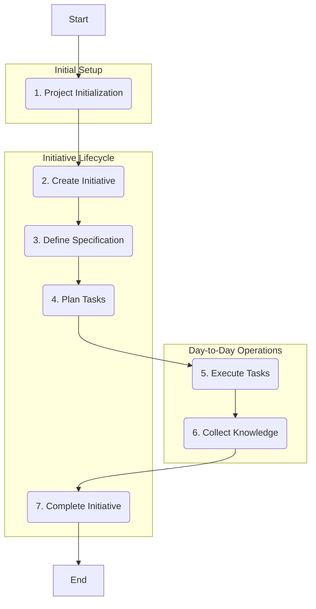

Of course. Here is the updated `Workflow.md` documentation.

# Devfluo Workflow Guide

This guide provides a comprehensive overview of the Devfluo MCP server, designed to help new users get started and effectively manage their development workflow. Devfluo empowers AI assistants to manage project initiatives, track decisions, and maintain a persistent, multi-level knowledge base.

## 🚀 Quick Start: Your First Steps

Getting started with Devfluo is simple. The first step is always to initialize your project's knowledge base.

1.  **Install & Configure:** First, ensure the Devfluo server is installed and your MCP client (like Claude Desktop or Continue) is configured to connect to it. You must set the `PROJECT_ROOT` environment variable to a dedicated directory where your knowledge will be stored (e.g., `/path/to/your/project/.knowledge-base`).

2.  **Initialize the Project:** Before you can do anything else, you must initialize the knowledge base. Use the `project_initialization` prompt. This command analyzes your codebase and creates the foundational `architecture.md` and `codebase.md` documents.

    * **MCP Prompt Command:**
      ```mcp
      @devfluo/project_initialization
      ```
    * **Natural Language Command for LLM:**
      > "Initialize the project. Analyze the entire codebase and create the initial architecture and codebase documentation."

## Core Development Workflow

The primary workflow in Devfluo is initiative-driven. An "initiative" represents a single, focused development project, like building a new feature or fixing a complex bug. The typical lifecycle follows a clear sequence of prompts.



### 1\. Project Initialization

As mentioned in the Quick Start, this is the mandatory first step. It sets up the foundational knowledge that all other operations build upon.

* **Prompt:** `project_initialization`
* **LLM Command:** \> "Initialize this project's knowledge base."

### 2\. Create an Initiative

Once the project is initialized, you can create an initiative to track a specific piece of work.

* **Prompt:** `initiative_create`
* **LLM Command:** \> "Create a new initiative with the ID 'user-authentication' and the name 'User Authentication System'."

### 3\. Define the Specification

With an initiative created, the next step is to define what needs to be built. This prompt starts a brainstorming session with the AI to produce a detailed specification document.

* **Prompt:** `initiative_specification`
* **LLM Command:** \> "Let's create the specification for the 'user-authentication' initiative."

### 4\. Plan the Tasks

After the specification is complete, the `initiative_planning` prompt helps you break down the work into a structured list of actionable tasks with phases and dependencies.

* **Prompt:** `initiative_planning`
* **LLM Command:** \> "Generate a complete task plan for the 'user-authentication' initiative based on its specification."

### 5\. Execute Tasks

This is where the core development work happens. The `initiative_task_execution` prompt provides the AI with all the necessary context (project knowledge, initiative spec, memory cards, and specific task details) to help implement a solution.

* **Prompt:** `initiative_task_execution`
* **LLM Command:** \> "Let's start working on tasks 't001' through 't003' for the 'user-authentication' initiative."

### 6\. Collect Knowledge

During or after task execution, it's crucial to capture what you've learned. This prompt helps you extract valuable decisions, solutions, and patterns and save them as **Memory Cards**.

* **Prompt:** `initiative_knowledge_collection`
* **LLM Command:** \> "Review the recent changes and our conversation for the 'user-authentication' initiative and help me create memory cards for any important decisions or patterns we developed."

### 7\. Complete the Initiative

Once all tasks are done, the final step is to complete the initiative. This prompt analyzes all the knowledge generated (memory cards, issues) and helps you promote any valuable, reusable insights to the global knowledge base.

* **Prompt:** `initiative_completion`
* **LLM Command:** \> "All tasks for the 'user-authentication' initiative are done. Let's complete the initiative and update the project's knowledge base."

## Managing Your Project: Common Operations

Not all work fits into a linear workflow. The following are common commands for managing the overall project state.

* **View Initiatives:**

  > "Show me a list of all current initiatives."

* **Manage the Backlog:** The `backlog_management` tool handles creating, updating, and deleting backlog items.

  > "Add a new item to the backlog with the ID 'api-rate-limiting' and name 'Implement API Rate Limiting'. The description is 'Protect the public API from abuse'."

* **Handle Issues & Scope Changes:** When things don't go as planned, use these prompts to analyze the situation and decide on a course of action.

    * **Prompt:** `initiative_scope_change`
    * **LLM Command:** \> "I've run into an issue with the 'user-authentication' initiative. The third-party OAuth provider just deprecated the API we were using. Let's analyze this scope change."
    * **Prompt:** `issue_resolution`
    * **LLM Command:** \> "Let's resolve the 'deprecated-oauth-api' issue for the 'user-authentication' initiative. I think we should choose the 'replan' strategy."

* **Search the Knowledge Base:** Use the `memory_cards_search` tool to find relevant information.

  > "Search the global memory cards for information about 'API design patterns'."

## Knowledge Base Structure

The `PROJECT_ROOT` directory contains all the persisted knowledge for your project, organized into a clear structure.

```
.
└── .knowledge-base/
    ├── base/
    │   ├── architecture.md
    │   └── codebase.md
    ├── backlog/
    │   └── user-feedback-system/
    │       ├── overview.md
    │       └── spec.md
    ├── initiatives/
    │   └── user-authentication/
    │       ├── overview.md
    │       ├── spec.md
    │       ├── memory-cards/
    │       │   └── oauth-redirect-handling.md
    │       ├── tasks/
    │       │   ├── t001.md
    │       │   └── t002.md
    │       └── issues/
    │           └── third-party-api-deprecation.md
    └── memory-cards/
        └── api-design-patterns.md
```

### Artifact Examples

* **architecture.md:** High-level overview of your system's components and design patterns.
* **codebase.md:** Details on project structure, key files, dependencies, and coding conventions.
* **memory-cards/api-design-patterns.md:** (Global Memory Card)
  ```markdown
  ---
  title: API Design Patterns
  contextIncludingPolicy: auto
  tags:
    - api
    - patterns
  ---
  # API Patterns
  This document outlines our standard approach to API design, including RESTful conventions...
  ```
* **initiatives/user-authentication/overview.md:** (Initiative Overview)
  ```markdown
  ---
  name: User Authentication System
  state: inprogress
  ---
  This initiative covers the implementation of a full OAuth2-based authentication system.
  ```
* **initiatives/user-authentication/tasks/t001.md:** (Task)
  ```markdown
  ---
  name: Setup OAuth Provider
  effort: M
  status: new
  order: 1
  phase: 1
  predecessors: []
  ---
  Configure the application to connect to Google and GitHub OAuth providers...
  ```